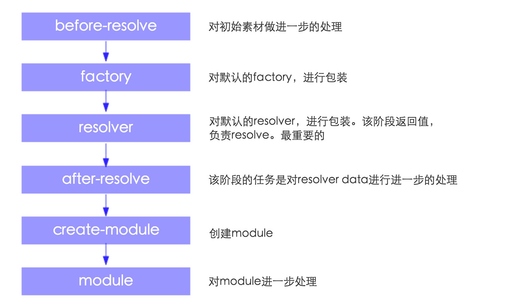

# Tapable  这个是一个很有用的类
1、applyPluginsAsyncWaterfall(name, init, callback) 

找到名称为name的插件，分别对init进行处理（下一个处理函数可以获得上一个处理函数的结果）     

最终处理后的结果传给callback     

插件签名:

```javascript
function(value,next){
	//......     
	//对value做进一步的处理      
	next(err,result)	
}
```
2、applyPluginsWaterfall0(name,init)     

实现的功能和applyPluginsAsyncWaterfall完全一样，只不过这个是同步版本    

插件签名:

```javascript
function(init){
	//......
	//对init做进一步的处理
	return init;
}
```

3、applyPluginsBailResult(name)

找出名称为name的插件执行，返回第一个不是undefined的结果，并结束


# ArrayMap

1.模拟字典 key,value 都可以为object     
2.接口：get(key),set(key,value),remove(key),clone()     

# NormalModuleFactory
1.继承自Tapable       

# SingleEntryPlugin
1.compilation 回调    
设置compilation.dependencyFactories.set(SingleEntryDependency, normalModuleFactory);   
2.make 回调    
compilation.addEntry(this.context, dep, this.name, callback);      
为compilation增加entry 

# Compilation
1.这个类继承自Tapable
2.重要属性说明
  chunks 所有chunk   
  namedChunks 命名chunk,就是有名字的。 chunk 就是Chunk类的实例 new Chunk(name, module, loc)   

# Chunk
1.这个类不继承其它任何类
1. 重要属性说明
   name = name; chunk 名字   
   modules = []; chunks 包含的modules   
   parents = []; 所属chunk，说明一个chunk，可以有多个父亲   
   files = [];chunk要生成的文件？   
   entry = false; 是否是entry chunk   
   initial = false; 是不是initial chunk  

# OccurrenceOrderPlugin
1.注册 optimize-module-order 插件 ，对modules进行排序
2.注册 optimize-chunk-order  插件 ，对chunks进行排序
3.具体排序规则，待具体研究  

# NoErrorsPlugin
1.注册 should-emit should-record 回调，如果存在错误，则跳过emitting阶段和recording阶段       
2.如果有错误的话，将不会有assets被emitted. 我测试的结果是，没有assets文件被生成       
3.If you are using the CLI, the webpack process will not exit with an error code by enabling this plugin            
通过使用这个插件，webpack进程就不会因为一个错误退出了;       
关于这种说法，没有能够证实。我用webpack --watch.无论是不是使用这个插件，遇到错误，都不会退出啊。     

# 有关loader
1.看到这块代码就可以知道loader中的！是干嘛用的了。它就是一个分割符。       
你不想用这个，就直接用数组吧。      
如果不是数组，就报错了。         
代码来自于LoadersList      
```javascript
var loaders = element.loaders || element.loader;
if(typeof loaders === "string") {
	loaders = loaders.split("!");
}else if(!Array.isArray(loaders)) {
	throw new TypeError("Element from loaders list should have one of the fields 'loader' or  'loaders'");
} 
```
#### loader是怎么调用的呢？ 

先从Compile的make阶段开始吧，如果entry为一个的话。

会触发SingleEntryPlugin中注册的make插件

```
compiler.plugin("make", function(compilation, callback) {
   var dep = new SingleEntryDependency(this.entry);
   dep.loc = this.name;
   compilation.addEntry(this.context, dep, this.name, callback);
}.bind(this));
```

 追踪一下compilation.addEntry发现会调用NormalModuleFactory的create方法创建module

```javascript   
function NormalModuleFactory(context, resolvers, parser, options) {
	Tapable.call(this);
	this.resolvers = resolvers;
	this.parser = parser;
	this.loaders = new LoadersList(options.loaders);
	this.preLoaders = new LoadersList(options.preLoaders);
	this.postLoaders = new LoadersList(options.postLoaders);
	this.plugin("factory", function() {
  
	});
	this.plugin("resolver", function() {
  
	});
}
NormalModuleFactory.prototype.create = function(context, dependency, callback) {
	//创建module
	//从这里开始他的生命周期
	//before-resolve 对初始素材做进一步的处理        
    //factory 该阶段的结果是一个函数，这个函数会对上一步的结果处理
    //resolver 该阶段的结果是一个函数，这个函数会对上一步的结果处理，处理后的值，很重要。它是创建module的素材
    //after-resolve applyPluginsAsyncWaterfall("after-resolve", data, function(err, result)  data为resolver的结果  该阶段的任务是对data进行进一步的处理
    //create-module applyPluginsBailResult("create-module", result) result为after-resolve阶段处理的值，该阶段的任务是创建module。
    //module   对module做进一步的处理
}
```

来张图，更清晰



接着分析，我想知道loader是如何调用的。

在resolver阶段，追踪到下面一样代码

```
_this.resolveRequestArray.bind(_this, contextInfo, _this.context, _this.loaders.match(resourcePath), _this.resolvers.loader),
```

先不管它是干什么的，我们主要关注一下_this.loaders.match(resourcePath)似乎与loader有关系啦

这个match方法的作用就是返回一个数组，数组中是匹配到loaders，举个例子：

```
var loader = new LoadersList([{
   test: /\.css$/,
   loader: 'css'
}]);
(loader.match('style.css')).should.eql(['css']);
```

具体LoadersList类的用法，可以查看它的测试文档，那里是查看api最好的地方。

我们把注意力，再次回到resolveRequestArray

```
NormalModuleFactory.prototype.resolveRequestArray = function resolveRequestArray(contextInfo, context, array, resolver, callback) {
   if(array.length === 0) return callback(null, []);
   async.map(array, function(item, callback) {
      if(item === "" || item[0] === "?")
         return callback(null, item);
      resolver.resolve(contextInfo, context, item, callback);
   }, callback);
};
```

接着分析 resolver.resolve(contextInfo, context, item, callback);  

需要注意一下，这里的item就是loader的字符串表示。

resolver 就是 _this.resolvers.loader 即，loader的解析器。

> loader的解析器，能找到loader对应的js文件所在的位置，目前还是猜测

我们接着找找，loader的解析器是什么?

先略过解析器吧，从这里往上回溯吧。

NormalModuleFactory的create方法，会创建一个module

> module.loaders就是这个module，应该使用的loader

module.loaders 什么时候调用的呢？

通过上面的分析，我们知道调用compilation.addEntry方法，会通过NormalModuleFactory.create方法创建module。接着会执行buildModule，在后来执行module.build方法。

NormalModule.build进而调用NormalModule.dobuild

```
NormalModule.prototype.doBuild = function doBuild(options, compilation, resolver, fs, callback) {
   var loaderContext = {
   };
   loaderContext._module = this;
   loaderContext._compilation = compilation;
   loaderContext._compiler = compilation.compiler;
   loaderContext.fs = fs;
   compilation.applyPlugins("normal-module-loader", loaderContext, this);
   /*运行该模块对应的loaders*/
   runLoaders({
      resource: this.resource,
      loaders: this.loaders,
      context: loaderContext,
      readResource: fs.readFile.bind(fs)
   }, function(err, result) {
   });
```

其中 this.loaders=['loader对应的js文件所在的位置'，'loader对应的js文件所在的位置']

经验证 runLoaders 负责执行loader

runLoaders 到底是什么？

https://github.com/webpack/loader-runner

loader 是如何执行的，分析到此结束吧。具体loader执行的细节，写一个主题接着分析。就要深入loader-runner源码了

#### loader具体执行细节

待续。。。。。。

