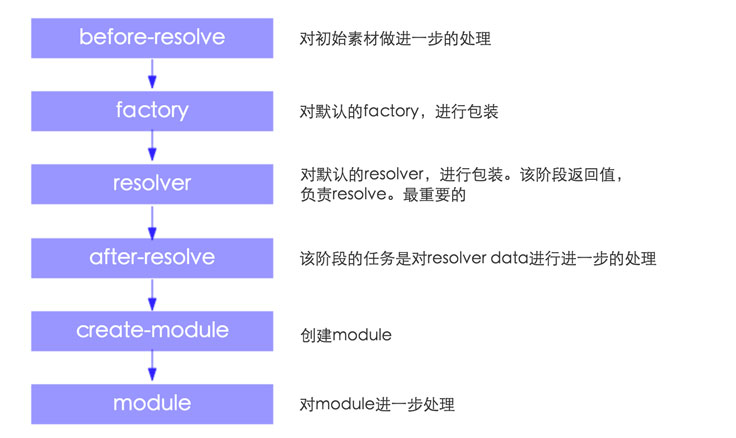

# Tapable  这个是一个很有用的类
1、applyPluginsAsyncWaterfall(name, init, callback) 

找到名称为name的插件，分别对init进行处理（下一个处理函数可以获得上一个处理函数的结果）     

最终处理后的结果传给callback     

插件签名:

```javascript
function(value,next){
	//......     
	//对value做进一步的处理      
	next(err,result)	
}
```
2、applyPluginsWaterfall0(name,init)     

实现的功能和applyPluginsAsyncWaterfall完全一样，只不过这个是同步版本    

插件签名:

```javascript
function(init){
	//......
	//对init做进一步的处理
	return init;
}
```

3、applyPluginsBailResult(name)

找出名称为name的插件执行，返回第一个不是undefined的结果，并结束


# ArrayMap

1.模拟字典 key,value 都可以为object     
2.接口：get(key),set(key,value),remove(key),clone()     

# NormalModuleFactory
1.继承自Tapable       

# SingleEntryPlugin
1.compilation 回调    
设置compilation.dependencyFactories.set(SingleEntryDependency, normalModuleFactory);   
2.make 回调    
compilation.addEntry(this.context, dep, this.name, callback);      
为compilation增加entry 

# Compilation
1.这个类继承自Tapable
2.重要属性说明
  chunks 所有chunk   
  namedChunks 命名chunk,就是有名字的。 chunk 就是Chunk类的实例 new Chunk(name, module, loc)   

# Chunk
1.这个类不继承其它任何类
1. 重要属性说明
   name = name; chunk 名字   
   modules = []; chunks 包含的modules   
   parents = []; 所属chunk，说明一个chunk，可以有多个父亲   
   files = [];chunk要生成的文件？   
   entry = false; 是否是entry chunk   
   initial = false; 是不是initial chunk  

# OccurrenceOrderPlugin
1.注册 optimize-module-order 插件 ，对modules进行排序
2.注册 optimize-chunk-order  插件 ，对chunks进行排序
3.具体排序规则，待具体研究  

# NoErrorsPlugin
1.注册 should-emit should-record 回调，如果存在错误，则跳过emitting阶段和recording阶段       
2.如果有错误的话，将不会有assets被emitted. 我测试的结果是，没有assets文件被生成       
3.If you are using the CLI, the webpack process will not exit with an error code by enabling this plugin            
通过使用这个插件，webpack进程就不会因为一个错误退出了;       
关于这种说法，没有能够证实。我用webpack --watch.无论是不是使用这个插件，遇到错误，都不会退出啊。     

# 有关loader
1.看到这块代码就可以知道loader中的！是干嘛用的了。它就是一个分割符。       
你不想用这个，就直接用数组吧。      
如果不是数组，就报错了。         
代码来自于LoadersList      
```javascript
var loaders = element.loaders || element.loader;
if(typeof loaders === "string") {
	loaders = loaders.split("!");
}else if(!Array.isArray(loaders)) {
	throw new TypeError("Element from loaders list should have one of the fields 'loader' or  'loaders'");
} 
```
loader是怎么掉用的呢？  
```javascript   
function NormalModuleFactory(context, resolvers, parser, options) {
	Tapable.call(this);
	this.resolvers = resolvers;
	this.parser = parser;
	this.loaders = new LoadersList(options.loaders);
	this.preLoaders = new LoadersList(options.preLoaders);
	this.postLoaders = new LoadersList(options.postLoaders);
	this.plugin("factory", function() {
  
	});
	this.plugin("resolver", function() {
  
	});
}
NormalModuleFactory.prototype.create = function(context, dependency, callback) {
	//创建module
	//从这里开始他的生命周期
	//before-resolve 对初始素材做进一步的处理        
    //factory 该阶段的结果是一个函数，这个函数会对上一步的结果处理
    //resolver 该阶段的结果是一个函数，这个函数会对上一步的结果处理，处理后的值，很重要。它是创建module的素材
    //after-resolve applyPluginsAsyncWaterfall("after-resolve", data, function(err, result)  data为resolver的结果  该阶段的任务是对data进行进一步的处理
    //create-module applyPluginsBailResult("create-module", result) result为after-resolve阶段处理的值，该阶段的任务是创建module。
    //module   对module做进一步的处理
}
```

来张图，更清晰

